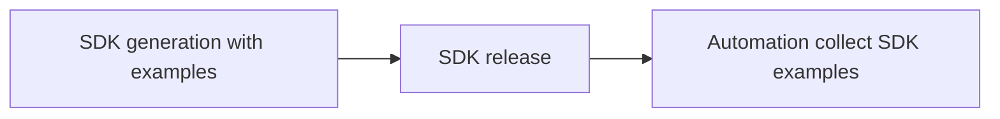
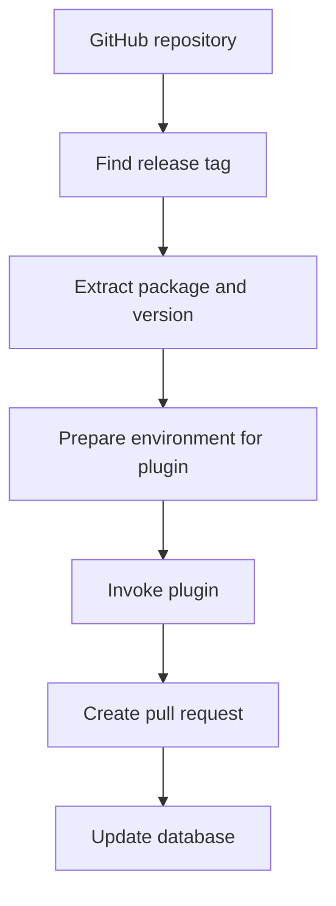
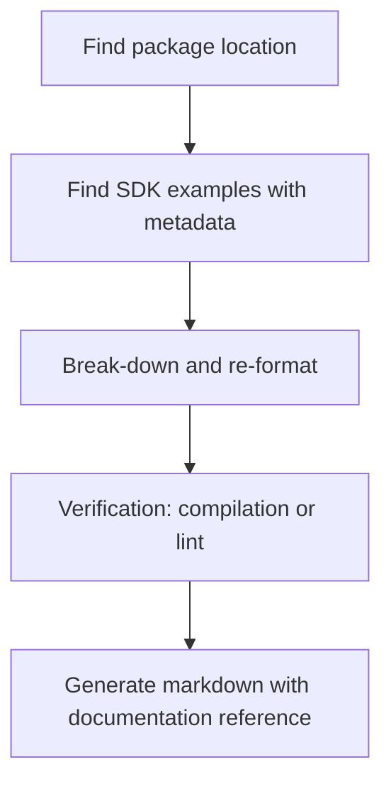

# Automation to collect SDK examples to central repository

## Goal for the repository that will be pulled by MSDocs team

The repository is [Azure/azure-rest-api-specs-examples](https://github.com/Azure/azure-rest-api-specs-examples).

1. Same folder structure as azure-rest-api-specs
2. Only examples of the released SDK will be uploaded
3. Keep it minimal

The repository serves as derived data. The truth resides in each SDK repository at each release tag.
And if necessary, it is possible to re-create the whole repository from SDK repositories (though it could take days).

We expect MSDocs team will generate final result similar to [Microsoft Graph](https://docs.microsoft.com/graph/api/user-post-events?view=graph-rest-1.0&tabs=http#examples).

At present, collection from Go and Java SDK is prototyped.

## Automation repository

As one of the goal is to keep Azure/azure-rest-api-specs-examples simple, we need another (private) repository for code on automation (configuration and tooling, etc.).

Currently it is at [azure-rest-api-specs-examples-automation](https://github.com/weidongxu-microsoft/azure-rest-api-specs-examples-automation).
It will be moved to e.g. Microsoft organization later.

## Design on the process to publish and collect SDK examples



### Stage 1: SDK generation

When SDK team generates package with new version, it also generates the examples and upload to SDK repo as well.
E.g. [an aggregated sample that composed by multiple SDK examples](https://github.com/Azure/azure-sdk-for-java/blob/f007ab8/sdk/datafactory/azure-resourcemanager-datafactory/src/samples/java/com/azure/resourcemanager/datafactory/generated/PipelinesCreateOrUpdateSamples.java)

For each example, a certain inline metadata is required. E.g.,
```
// x-ms-original-file: specification/compute/resource-manager/Microsoft.Compute/stable/2021-04-01/examples/CreateACustomImageVmFromAnUnmanagedGeneralizedOsImage.json
```

[AutoRest.Core 3.6.0 and Modeler Four 4.21.0](https://github.com/Azure/autorest/blob/main/packages/extensions/core/CHANGELOG.md#360) supports the `x-ms-original-file` extension under `x-ms-examples` extension, given option `include-x-ms-examples-original-file=true`.
So it is not hard to transform Modeler Four output to this metadata in SDK examples.

The inline metadata points us to the location of the source JSON example.
E.g. the [JSON example](https://github.com/Azure/azure-rest-api-specs/blob/master/specification/compute/resource-manager/Microsoft.Compute/stable/2021-04-01/examples/CreateACustomImageVmFromAnUnmanagedGeneralizedOsImage.json)

This way, the automation is able to locate the JSON example file, and potentially break the aggregated sample and post its components to corresponding location to examples repository.

This step is done by SDK team. Only `x-ms-original-file` inline metadata is required.

### Stage 2: SDK release

When SDK team releases the new package, release pipeline will automatically create a new release tag.

For instance, Java release tag is "azure-resourcemanager_2.7.0". Go release tag is "sdk/resourcemanager/containerservice/armcontainerservice/v0.2.1".
Generally the release tag contains the package/module name and version.

This step is already fully automated via release pipeline.

### Stage 3: Automation to collect the examples

Potentially it includes compiler and formatter, if there is requirement to break the aggregated SDK sample to multiple SDK examples.

So that after break-down and re-construction of the examples, automation will verify compile pass, with correct formatting.

Documentation reference is something like below, so that customer can get to the SDK doc and start using it.
As usually the configuration of the project and required authentication is not included in the example.
```
Read the [SDK documentation](https://github.com/Azure/azure-sdk-for-java/blob/azure-resourcemanager_2.7.0/sdk/resourcemanager/README.md) on how to add the SDK to your project and authenticate.
```

The final result could be like [this compute example in markdown](https://github.com/Azure/azure-rest-api-specs-examples/blob/main/specification/compute/resource-manager/Microsoft.Compute/stable/2021-07-01/examples-java/compute/CreateACustomImageScaleSetFromAnUnmanagedGeneralizedOsImage.md).

This step is done by the automation, with possible plugin from language to help convert aggregated sample to the final markdown.

### Alternative considered

Step 1, when SDK team generates the package, it generates a specific version of the examples that matching the JSON example, and upload it to an intermediate repository.

But flag it as "not released".

Step 2, when SDK team releases the package, flag it as "released".

Documentation reference is still required.

Step 3, automation copy the "released" ones to the central repo.

## Design on the Automation to collect the examples

Automation runs on Ubuntu 20.04 image.
It runs as a batch job.

Core functionality is implemented once.
1. Find candidate release tags from SDK repository.
2. Prepare input, call script, parse output.
3. If success, commit the output to example repository, also update database.

In (1), currently the batch job is configured as daily job, and it pulls release tag within 3 days, for simple fault-tolerance.

In (2), language plugin as script will process the examples in the release tag, convert them to the final markdown, put them to target path.
These plugins can be implemented by different language, consume customized configuration, and run customized logic, as long as it can have the desired output.



A few thoughts on the plugin.
1. Verify that the package is indeed released (for some SDK, it could happen that a release tag is created, but the follow-up package publish failed).
2. Find the examples in the release tag.
3. Break-down the aggregated sample and re-construction to the SDK example (one to one map of the result example to JSON example).
4. Verify that the SDK example can pass compilation.
5. Prepare the documentation reference.
6. Make the final markdown by composing of the documentation reference and the SDK example.
7. Output the markdown to its intended location.



### Details

The automation will run as stateless job.

The configuration on the automation looks like below:

```json
{
  "sdkExample": {
    "repository": "https://github.com/Azure/azure-rest-api-specs-examples"
  },
  "sdkConfigurations": [
    {
      "name": "azure-sdk-for-java",
      "language": "java",
      "repository": "https://github.com/Azure/azure-sdk-for-java",
      "releaseTag": {
        "regexMatch": "azure-resourcemanager.*_.+",
        "packageRegexGroup": "(.*)_.*",
        "versionRegexGroup": ".*_(.*)"
      },
      "script": {
        "run": "java/main.sh"
      }
    }
  ]
}
```

For each plugin, defines the SDK repository and expected format of the release tag for management-plane SDK.
Automation will get all the releases (within a few days, which can be controlled in pipeline), match the release tag pattern.

For each of the matched release tag, automation prepare a temporary directory, checkout the SDK repository on release tag, create an `input.json`, and call the script to process it.

A typical `input.json` would look like below:

```json
{
  "specsPath":"/home/vsts/work/1/s/tmp/spec",
  "sdkExamplesPath":"/home/vsts/work/1/s/tmp/tmpdxab6792/example",
  "sdkPath":"/home/vsts/work/1/s/tmp/tmpdxab6792/sdk",
  "tempPath":"/home/vsts/work/1/s/tmp/tmpdxab6792",
  "release":{
    "tag":"azure-resourcemanager-servicefabric_1.0.0-beta.2",
    "package":"azure-resourcemanager-servicefabric",
    "version":"1.0.0-beta.2"
  }
}
```

Plugin would be expected to parse the examples within the SDK repository (`sdkPath`), and generate markdowns to `sdkExamplesPath`.

Plugin can output details to `output.json`.

A typical `output.json` would look like below:

```json
{
  "status":"succeeded",
  "name":"github.com/Azure/azure-sdk-for-go/sdk/resourcemanager/containerservice/armcontainerservice@v0.2.1"
}
```

`status` could be `succeeded` or `failed`.
`name` is used for bookkeeping. Changed files will be picked-up by `git status`.

Automation treats a plugin completed without error and without `output.json` as `succeeded`.

After plugin reports success, automation will check the repository in `sdkExamplesPath`, and create GitHub pull request to merge the changes.
It is possible that this release tag is already processed by a previous run of the automation (due to the stateless nature), in this case no changes and hence no pull request.

Here is the [PoC implementation](https://github.com/weidongxu-microsoft/azure-rest-api-specs-examples-automation/) of the automation and Java/Go SDK integration.
1. `automation` folder contains the shared core functionality.
2. `java` folder contains script handling the Java SDK examples. 
3. `go` folder contains script handling the Go SDK examples.

Here are a few [pull requests](https://github.com/Azure/azure-rest-api-specs-examples/pulls?q=is%3Apr+is%3Aclosed) created by the automation (PoC implementation) for SDK.

### A few issues observed in PoC

1. Validation could take lots of time. Complication for each example could take a few seconds for Java. With some RP of thousands of examples, this could take long (thread pool helps but not much).
2. In some rare case, one run could pull 2 different version from a single package (if these version get released in short time). It could be a problem if the PR is configured as auto-merge.

For the former issue, approach of batch validation is used whenever possible.
For example, Java and Go plugin will put all examples in one project folder, build them all, and check if any failure.

### What information during collection need persistence

This depends on what devs might query.

Task: update markdown of certain SDK versions. E.g. update markdown to notify availability of a newer SDK; notify that certain SDK or version is deprecated.
Query: all example files belonging to a certain SDK version.
Requirement: table of file + SDK info.

Task: update markdown when JSON example is modified.
Query: the SDK corresponding to the example, and its AutoRest command.
Requirement: table of file + SDK info, and SDK info contains the AutoRest command.

Task: clean up markdown that no longer match to JSON example (e.g. JSON example could be deleted).
Alternative: this could be handled by a background job, instead of query.

So far, it appears that a table of file + SDK info would satisfy basic query requirements.

As reference, current "Azure/azure-rest-api-specs" repository contains about 60,000 JSON examples.
Therefore, we would expect "Azure/azure-rest-api-specs-examples" would eventually contain similar number of files (could be 1 order more, as it contains examples from multiple languages).

Maintains information on releases and files.

Table schema:

```sql
create table release (
    id          integer         not null primary key,
    name        varchar(255)    not null,
    language    varchar(255)    not null,
    tag         varchar(255)    not null,
    package     varchar(255)    not null,
    version     varchar(255)    not null,
    date_epoch  integer         not null,

    unique(name, language)
)

create index release_idx1 on release(language, package, version)

create table file (
    id          integer         not null primary key,
    file        varchar(511)    not null,
    release_id  integer         not null,

    foreign key(release_id) references release(id)
        on delete cascade

    unique(file)
)
```

## TODO

### Issue 1

The case that the SDK example is outdated. For example, service might pin the REST API to 2020-02-01, but their service and SDK is on 2021-06-01.
Even if they change/fix swagger for api-version 2020-02-01, SDK might not ever re-release for 2020-02-01 again.

For now, we probably do not have good solution, except try to ask service to update their REST API doc configuration to move to later api-version.

One mitigation is to update the document reference part (periodically), to notify reader that a new SDK is available.
E.g.
```
Read the [SDK documentation](https://github.com/Azure/azure-sdk-for-java/blob/azure-resourcemanager_2.6.0/sdk/resourcemanager/README.md) on how to add the SDK to your project and authenticate.
The latest SDK is [2.7.0](https://github.com/Azure/azure-sdk-for-java/blob/azure-resourcemanager_2.7.0/sdk/resourcemanager/README.md).
```

### Issue 2

The case that service only update JSON example, but did not touch swagger specs.

Ideal solution would to have another automation to catch this and re-generate SDK examples.
For this, we will need to pin down all the parameter (of AutoRest) to create that SDK.
If possible we should also ping down the swagger JSON (in case the tag in README is modified).

Currently, this is available in some SDK but not all of them.

### Issue 3

The case that developer generate the SDK based on swagger not on specs main branch (e.g. a dev branch, or the private repository).

If the swagger eventually will be merged to specs main, we should be fine.

If the swagger will not be merged to specs main (a very unlikely case), developer can use option `include-x-ms-examples-original-file=false` to disable the `x-ms-original-file` metadata.
